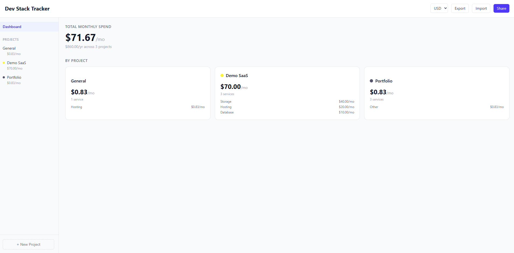

<h1 align="center">Dev Stack Tracker</h1>

<p align="center">
  
</p>

<p align="center">
  <em>A project-scoped tracker for everything your side projects are paying for. Runs entirely in the browser.</em>
</p>

<p align="center">
  <a href="https://dev-stack-tracker.vercel.app"><strong>Live demo →</strong></a>
</p>

<p align="center">
  
  
  
  
  
</p>

---

## What is this

I kept losing track of what my side projects were costing me. Vercel for one thing, Supabase for another, a domain I forgot I renewed — all spread across dashboards I never open.

Dev Stack Tracker is where I put it all. Services grouped by project, monthly total on the front page, and that's mostly it. No account, no backend. It's a Vite + React app that reads and writes `localStorage`, with JSON import/export and a share button that packs the whole stack into a URL hash when you want to hand someone a copy.

> **Heads up on the data model.** Everything lives in your browser's `localStorage` — clearing site data wipes your stack, so export a JSON backup if it matters. Share links contain the full stack encoded in the URL itself, and opening one drops the recipient into an import dialog (not a read-only view), so don't put anything sensitive in a notes field and then paste that link into a public channel.

## Features

- **Projects with services** — group by project with color labels; the dashboard rolls up per-project and per-category totals
- **Nine preset categories** — Infra, Storage, API, Auth, Email, Hosting, Database, CI/CD, Other, with free-text if none of those fit
- **Monthly and yearly billing** — yearly costs are divided into a monthly figure for the total. One-time costs can be tracked on a service but are intentionally excluded from the recurring monthly total
- **JSON import/export** — full-stack or per-project files, with merge or replace on import
- **Share links** — the whole stack is base64-encoded into a URL hash; the recipient lands in an import dialog
- **Currency display** — USD, EUR, GBP formatting (display only — no FX conversion)

## Tech Stack

| Layer | Choice |
|-------|--------|
| Build | Vite + React + TypeScript |
| State | Zustand with localStorage persistence |
| Styling | Tailwind CSS v4 |
| Primitives | Radix UI (Dialog, Dropdown) |

## Getting Started

Requires Node 20 or newer.

```bash
# Clone the repo
git clone https://github.com/Sabdulb/dev-stack-tracker.git
cd dev-stack-tracker

# Install dependencies
npm install

# Start dev server
npm run dev
```

Open [http://localhost:5173](http://localhost:5173) in your browser.

## Build

```bash
npm run build
npm run preview
```

## Deploy

One-click deploy to Vercel or Netlify — just connect the repo. No environment variables required.

## Contributing

Contributions are welcome! Please open an issue first to discuss what you'd like to change.

## License

[MIT](LICENSE)
